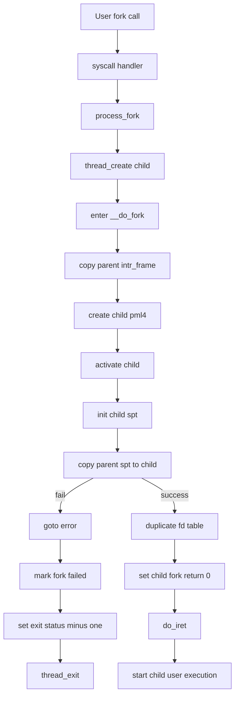
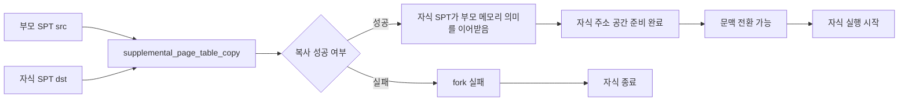
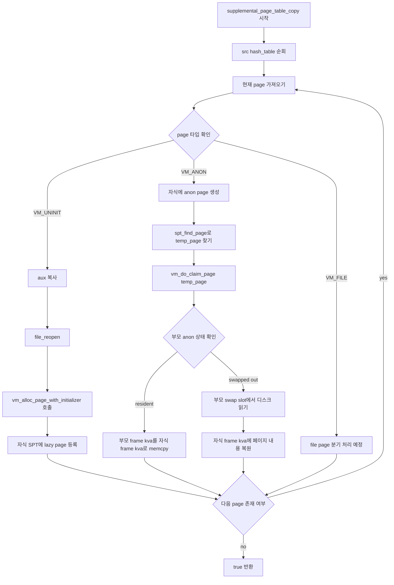
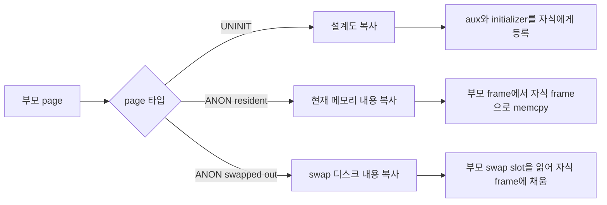
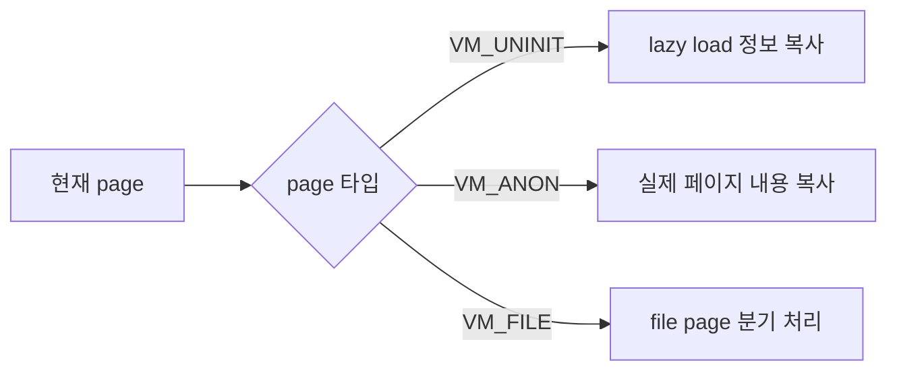
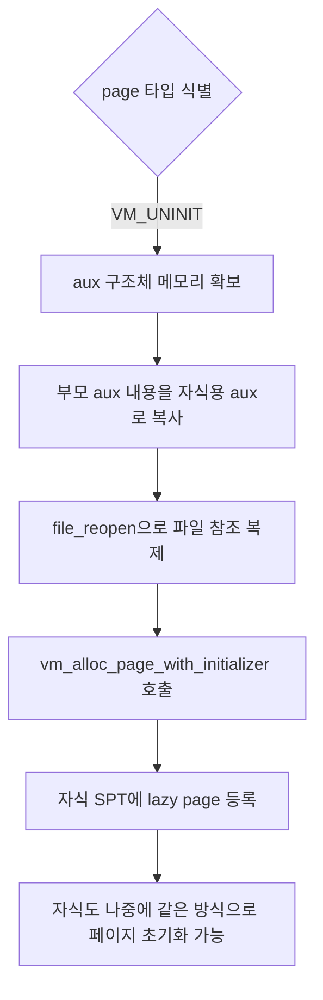
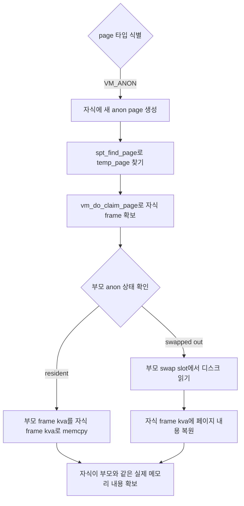

# VM Fork Call Flow

## 왜 이 함수가 중요한가

`supplemental_page_table_copy()`는 `fork()` 전체 흐름 안에서  
**부모 프로세스의 가상 메모리 상태를 자식 프로세스에게 복제하는 핵심 단계**이다.

이 함수가 성공해야만 자식 프로세스는 부모와 동일한 메모리 의미를 가진 상태로 실행을 시작할 수 있다.

---

## 전체 호출 흐름

```text
User Program
  -> fork() system call
  -> syscall_handler()
  -> process_fork()
  -> thread_create(..., __do_fork, ...)
  -> __do_fork()
  -> supplemental_page_table_copy(&child->spt, &parent->spt)
  -> 성공 시 자식의 pml4 유지 + fd table 복제 + do_iret()
  -> 자식 프로세스 실행 시작
```

---

## 호출 체인에서의 위치

```text
fork()
 └─ process_fork()
    └─ __do_fork()
       ├─ 부모의 intr_frame 복사
       ├─ child pml4 생성
       ├─ process_activate(child)
       ├─ supplemental_page_table_init(&child->spt)
       ├─ supplemental_page_table_copy(&child->spt, &parent->spt)
       ├─ fd_table 복제
       ├─ 자식의 fork 반환값을 0으로 설정
       └─ do_iret()로 유저 모드 진입
```

즉 `supplemental_page_table_copy()`는  
**자식 프로세스가 실제로 유저 모드로 진입하기 직전에 반드시 통과해야 하는 메모리 복제 단계**이다.

---

## 실패 시 의미

`supplemental_page_table_copy()`가 `false`를 반환하면:

1. 자식의 주소 공간 구성이 실패한 것으로 본다
2. `__do_fork()`는 `goto error` 경로로 이동한다
3. 자식은 `fork_success = false`, `exit_status = -1` 상태로 종료된다
4. 부모는 정상적인 자식 프로세스를 얻지 못한다

즉 이 함수의 실패는 단순한 보조 실패가 아니라  
**fork 자체의 실패**를 의미한다.

---

## 성공 시 의미

`supplemental_page_table_copy()`가 `true`를 반환하면:

- 자식 SPT가 부모 SPT의 메모리 의미를 이어받았고
- 자식의 pml4 위에서 해당 가상 메모리 구조를 사용할 준비가 끝났으며
- 이후 문맥 전환(context switch)과 유저 모드 진입이 가능해진다

즉 이 함수는  
**fork의 “메모리 복제 게이트”** 역할을 한다.

---

## 발표용 핵심 문장

> `supplemental_page_table_copy()`는 `fork()` 흐름에서  
> 부모의 가상 메모리 상태를 자식에게 독립적으로 복제하는 단계이며,  
> 이 함수가 성공해야만 자식 프로세스가 올바른 주소 공간을 가진 채 문맥 전환되어 실행을 시작할 수 있다.

---

## Mermaid Graph





---

## spt_copy 내부 로직







---

## VM_UNINIT 분기 그래프



---

## VM_ANON 분기 그래프


